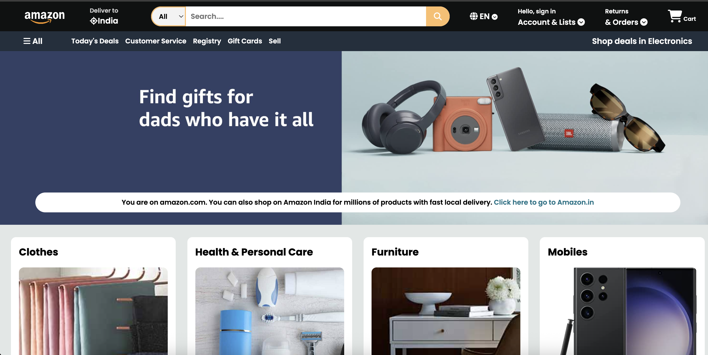

# 🛍️ Amazon Front-End Clone

A simple front-end clone of the Amazon homepage built using HTML and CSS. This project focuses on layout design, responsive styling, and UI structure without using any JavaScript or backend.

---

## 📸 Preview

---

## 🚀 Features

- Responsive layout similar to Amazon's homepage
- Navigation bar with logo, search bar, and menu
- Product cards, banners, and footer design
- Clean and structured HTML5 + CSS3 code
- No JavaScript – pure front-end clone

---

## 🛠️ Tech Stack

- HTML5
- CSS3
- Font Awesome (optional for icons)
- Google Fonts (for typography)

---

## 📁 Folder Structure
amazon-clone/
├── index.html
├── style.css
├── images/
└── README.md
